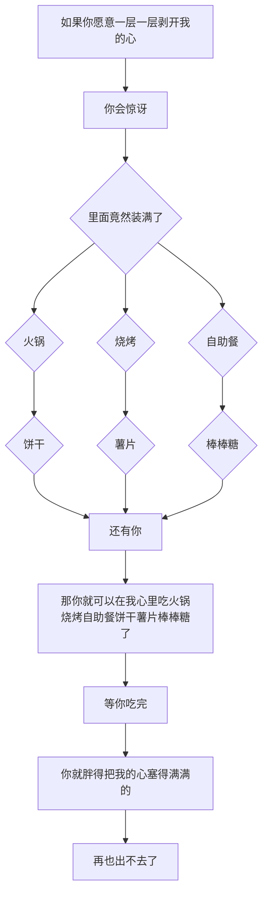
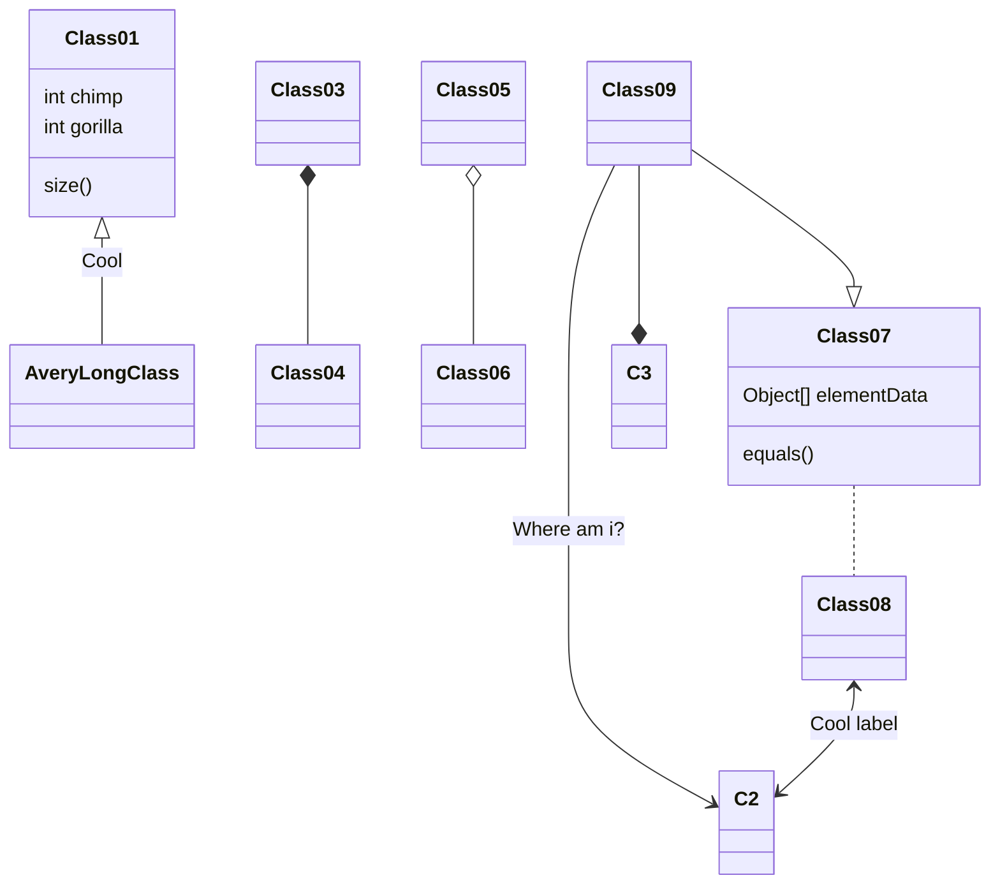

写博客过程中遇到了要插流程图、时序图和思维导图的问题，实在是不想去插图片了，能用语法解决的事情为什莫要插图片？于是我打开了Google、bing，于是我又发现了新世界。  
# Mermaid
首先贴一下官方的[主页](https://www.npmjs.com/package/hexo-filter-mermaid-diagrams)和[GitHub](https://github.com/webappdevelp/hexo-filter-mermaid-diagrams)  
## 打开主题的支持
我用的主题是`next-7.4`（吐槽一下7.3的local_search不能用的bug），如果你也是这个版本，那么可以直接去主题的`_config.yml`文件中去查找`mermaid` ,将这个模块的enable改为true就可以。  

```
# Mermaid tag
mermaid:
  enable: true
  # Available themes: default | dark | forest | neutral
  theme: forest
```
## 安装插件
然后安装`hexo-filter-mermaid-diagrams`,官方使用的是`yarn`安装的插件，其实用`npm`也可以。  
```
npm install hexo-filter-mermaid-diagrams

yarn add hexo-filter-mermaid-diagrams 
#任选其一
```
## 配置config与swig
1. 编辑博客根目录下的`/_config.yml`，在最后添加如下内容：  
```
# mermaid chart
mermaid: ## mermaid url https://github.com/knsv/mermaid
  enable: true  # default true
  version: "7.1.2" # default v7.1.2
  options:  # find more api options from https://github.com/knsv/mermaid/blob/master/src/mermaidAPI.js
    #startOnload: true  // default true
```
2. 编辑blog/themes/next/layout/_partials/footer.swig，在最后添加如下内容：
```

  <script src='https://unpkg.com/mermaid@{{ theme.mermaid.version }}/dist/mermaid.min.js'></script>
  <script>
    if (window.mermaid) {
      mermaid.initialize({{ JSON.stringify(theme.mermaid.options) }});
    }
  </script>

```

## 在vscode上安装插件预览
在插件中搜索`mermaid`,直接安装，然后在命令中搜索  

就可以进行预览了.
ps:用了一会,感觉还是下面这个好用一点,也不用单独命令预览,依旧使用markdown的`all in one`的插件就可以预览  





# 又记
又发现一个不一样的流程图工具，这个看起来更好看一点，有空试试
```
npm install --save hexo-filter-flowchart
```
## 参考
[荒野之萍的博客](https://www.cnblogs.com/icoty23/p/10911231.html)  
[插件官方GitHub](https://github.com/webappdevelp/hexo-filter-mermaid-diagrams)  
[Mermaid插件官方主页](https://www.npmjs.com/package/hexo-filter-mermaid-diagrams)
