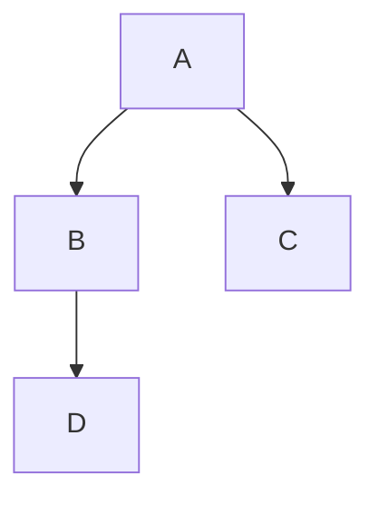

	
<blockquote class="blockquote-center">优秀的人，不是不合群，而是他们合群的人里面没有你</blockquote>

# 整体架构
按照官方的Wiki来看，ROS整体是由文件系统级、计算图级、社区级三个层级，这里先来看一下他的工程目录结构。
<!--more-->
# 文件系统
其不同功能的组件是放在不同的目录下的，目录是按照功能进行分类的。

```mermaid
graph TD;
    A-->B;
    A-->C;
    B-->D;
```