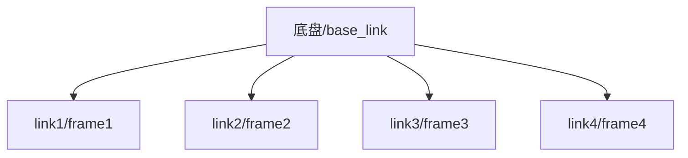

ROS中仿真一般使用URDF模型来仿真，它可以直接通过写脚本的方式实现模型的构建，详情可以看wiki，但是这种方式首先建模不精细，其次过程太痛苦了，如果想要简单一点的话我们可以通过想SW或者matlab这样的软件直接导出模型使用，导出的URDF文件可以在Rviz、gazebo还有V-rep等仿真器里直接使用。  
<!--more-->
# 安装插件
http://wiki.ros.org/sw_urdf_exporter  
官网上有很详细的说明，他不推荐用2018的SW，但是不幸的是我就是这个版本的，懒得换了，我也没发现有啥不对劲的（PS：现在我已经发现不对劲了，浪费了我好长时间，我都要手工写了整个URDF文件了）。  
直接下载下来双击安装，记得改安装的路径安装到SW的目录下，WIN10应该是不区分大小写的。  
# 画图
装配体的装配关系并不影响最后的仿真,因为SW还没有智能到这种程度，真正在模型中起约束作用的还是link和joint的属性。  
所以随便画了，镜像什么的随便用，一开始我还以为是不可以的。  

Solidworks中的零件被当做一个link，link可以指定许多属性：

1. <inertial>    定义惯性参数（Kinematic and dynamic description of the robot）
2. <visual>      定义外观，大小，颜色和材质纹理贴图（Visual representation of the robot）
3. <collision>   定义碰撞检测属性（Collision model of the robot）

这些属性导出时和工具→评估→质量属性里的设置保持一致。
# 构建基准轴和坐标系
  
这一步似乎是可以跳过的，因为后边SW可以选择自动生成。但是我们还是自己构建一下。  
对joint和link的定义不理解的可以去看官方的Wiki还有像古月的博客，虽然我很烦那些卖套件和卖课的，但是这些基础的定义他们写的还是可以的（当然官网的是最全、最准确的，尽量看官网的）。  
在下边的描述中我是默认读者对———— origin 描述的是joint相对父节点的相对位置、axis是描述joint的运动学参数等等是熟悉的。

下边我写的都是他们没有的。  

我理解的SW做的工作就是把基准轴转换成了joint，把坐标系转换成了对应link的坐标系，在生成link时零件和参考坐标系之间的相对位置不变的转换成了link和他的坐标系（这一点2018的SW经过我无数次的验证，已经确定是有BUG的，不要再用18了，他导出的STL坐标原点不在我规定的坐标原点，当然也可能是我的软件问题，毕竟没有交保护费）  
总结起来就是，SW总共做了两件事：
1. 得到joint的位置和朝向（Axis）
2. 将零件转化为link并定义link的坐标（frame）  

## 基准轴
基准轴会转换成joint，我们需要自己指定轴的类型。  
现有的选项有：
1. revolute - 旋转关节，其极限位置由 upper and lower limits 决定，类似舵机的情况
2. continuous - 旋转关节，无位置限制，一般的电机可以用这个类型
3. prismatic - 滑动关节，其极限位置由 upper and lower limits 决定，用于滑轨等等
4. fixed - 虚拟关节，关节不可运动，用于直接固定，比如激光雷达双目等等直接固定在车体上的
5. floating - 六自由度关节
6. planar - 平面关节

比如我们创建一个轮子的转轴：
1. 点击基准轴
  
2. 设置转轴方向  
以垂直轮子侧面的方向为轴做转动，转动中心由frame原点确定。  
  
  
这样我们的坐标轴就建好了，下边建立参考坐标系。
## 坐标系
定义的坐标系在导出URDF之后是和link绑定的，frame的姿态就是link的姿态，frame绕轴做轴对应属性的运动，frame原点就是link的运动中心。  
在ROS与SW中坐标系统一使用一下颜色定义：  
红-》x 蓝色-》z 绿色-》y  
1. 点击坐标系
  
2. 确定frame的原点与朝向
  
link是按frame的原点绕axis做运动的，所以我们应该把frame的原点设置在轮子的圆心处，可以看到我在旁边还设置了几个坐标系，如果最后选择那几个坐标系的话轮子就会绕那几个坐标系的原点转动，可以自己尝试一下。  
同时我们的坐标系最好是按照ROS的规范进行设置，一般情况下我们的Z轴是朝上的，Y轴是向左的，X轴是向前的，满足右手坐标系，当然如果不这么干也可以，效果是一样的。  
如果是滑轨之类的则一般Z轴为滑动方向，转动关节一般以Z轴为轴，当然这些都是一般情况，坐标系可以随便设置，不影响结果，只影响计算过程。  

对每一个joint都重复以上操作，定义所有的joint。  
# 配置参数
点击 工具》file》Export as URDF 导出
  
ros的TF是以树状的形式存在的，我们需要设置一个根link的frame，一般默认名字为base_link，比如我们的车子，我们将base_link建在中心的底板上，将frame1建立在第一个轮子（link1）上、将frame2建立在第二个轮子（link2）上……以此类推，我们可以得到我们的TF树为：  

  
如果我们是一个机械臂就会出现一个链式的运动链。  
我们车子坐标轴（Axis）和坐标系（frame）的总览：
  
设置base_link:

设置子link和对应的轴属性：
  
都设置好之后可以点Preview and export进行导出，进入下边的配置界面，对joint进行设置，如果前边设置的都没问题这里基本不用动。  
  
点下一步，可以进入link属性的设置，这里可以设置贴图（Texture）、质量、惯性张量、初始位置、材料颜色等特性，这里可以看上边画图那一步的说明。 点击Finish，在文件名中添加你的package的想要的名字（这个名字不能有中文，不然编译不过），就会生成一个完整的ros package。  
  
我们可以看到下面这个目录：  
  
导出之后导入到工作空间中，这个时候修改一下launch文件，打开use_gui选项，这样就可以使用ui直接拖动控制轮子
  
# 其他注意事项
如果没有导出整个目录，则要将urdf文件导入到工作空间中，然后将STL文件导入到包中的meshes文件夹中（没有可以新建一个），可以使用下边的模板：
```xml
<launch>
  <arg name="model" />
  <arg name="gui" default="true" />

  <param name="robot_description" textfile="$(find package_name)/urdf/SLDASM.urdf" />
  <param name="use_gui" value="$(arg gui)" />

  <node name="joint_state_publisher" pkg="joint_state_publisher" type="joint_state_publisher" />
  <node name="robot_state_publisher" pkg="robot_state_publisher" type="state_publisher" />
  <node name="rviz" pkg="rviz" type="rviz" args="-d $(find package_name)/rviz/urdf.rviz" />
</launch>
```
修改其中的URDF文件路径就可以显示了，同时还需要修改launch文件中的STL搜索的路径，很容易看明白的，这里就不贴代码了。  
我在2020的SW中安装了1.5.1版本的插件，生成的launch文件中urdf的路径是没问题的，但是其他版本的SW应该是不对的，我之前使用18的SW会生成：  
```xml
<param name="robot_description" textfile="$(find package_name)/robots/SLDASM.urdf" />   <!-- 这里的robots应改为urdf  -->
```
机械臂和小车的形式是不一样的，机械臂有一个固定的底座，这个底座就是base_link,但是小车的话整个都是运动的，这一点要考虑进去。  
下边贴一下我做的示例（应该是轮子1（link1）的frame不在原点处的示例）：
```xml
<?xml version="1.0" encoding="utf-8"?>
<!-- This URDF was automatically created by SolidWorks to URDF Exporter! Originally created by Stephen Brawner (brawner@gmail.com) 
     Commit Version: 1.5.1-0-g916b5db  Build Version: 1.5.7152.31018
     For more information, please see http://wiki.ros.org/sw_urdf_exporter -->
<robot
  name="SLDASM_6">
  <link
    name="base_link">
    <inertial>
      <origin
        xyz="3.16257321540939E-19 2.78943508064166E-18 0.0025"
        rpy="0 0 0" />
      <mass
        value="0.36355871410233" />
      <inertia
        ixx="0.0019785762122608"
        ixy="3.14121837617012E-19"
        ixz="-1.06598079349227E-38"
        iyy="0.00227552353547264"
        iyz="-1.03397576569128E-22"
        izz="0.00425258491975801" />
    </inertial>
    <visual>
      <origin
        xyz="0 0 0"
        rpy="0 0 0" />
      <geometry>
        <mesh
          filename="package://SLDASM_6/meshes/base_link.STL" />
      </geometry>
      <material
        name="">
        <color
          rgba="1 1 1 1" />
      </material>
    </visual>
    <collision>
      <origin
        xyz="0 0 0"
        rpy="0 0 0" />
      <geometry>
        <mesh
          filename="package://SLDASM_6/meshes/base_link.STL" />
      </geometry>
    </collision>
  </link>
  <joint
    name="44"
    type="continuous">
    <origin
      xyz="0.10304 -0.11866 -0.028"
      rpy="0 0 -1.0472" />
    <parent
      link="base_link" />
    <child
      link="4" />
    <axis
      xyz="1 0 0" />
  </joint>
  <link
    name="1">
    <inertial>
      <origin
        xyz="-3.4694E-18 -0.028507 0.032624"
        rpy="0 0 0" />
      <mass
        value="0.14787" />
      <inertia
        ixx="7.1802E-05"
        ixy="1.3715E-20"
        ixz="-1.2607E-20"
        iyy="8.4923E-05"
        iyz="2.2725E-05"
        izz="0.00011116" />
    </inertial>
    <visual>
      <origin
        xyz="0 0 0"
        rpy="0 0 0" />
      <geometry>
        <mesh
          filename="package://SLDASM_6/meshes/1.STL" />
      </geometry>
      <material
        name="">
        <color
          rgba="1 1 1 1" />
      </material>
    </visual>
    <collision>
      <origin
        xyz="0 0 0"
        rpy="0 0 0" />
      <geometry>
        <mesh
          filename="package://SLDASM_6/meshes/1.STL" />
      </geometry>
    </collision>
  </link>
  <joint
    name="11"
    type="continuous">
    <origin
      xyz="-0.13855 -0.09816 -0.028"
      rpy="1.5708 -1.5708 0" />
    <parent
      link="base_link" />
    <child
      link="1" />
    <axis
      xyz="0 0.5 0.86603" />
  </joint>
  <link
    name="2">
    <inertial>
      <origin
        xyz="0.014 1.3878E-17 0"
        rpy="0 0 0" />
      <mass
        value="0.14787" />
      <inertia
        ixx="0.00012428"
        ixy="0"
        ixz="2.8141E-21"
        iyy="7.1802E-05"
        iyz="7.3107E-21"
        izz="7.1802E-05" />
    </inertial>
    <visual>
      <origin
        xyz="0 0 0"
        rpy="0 0 0" />
      <geometry>
        <mesh
          filename="package://SLDASM_6/meshes/2.STL" />
      </geometry>
      <material
        name="">
        <color
          rgba="1 1 1 1" />
      </material>
    </visual>
    <collision>
      <origin
        xyz="0 0 0"
        rpy="0 0 0" />
      <geometry>
        <mesh
          filename="package://SLDASM_6/meshes/2.STL" />
      </geometry>
    </collision>
  </link>
  <joint
    name="22"
    type="continuous">
    <origin
      xyz="-0.10304 0.11866 -0.028"
      rpy="0 0 2.0944" />
    <parent
      link="base_link" />
    <child
      link="2" />
    <axis
      xyz="1 0 0" />
  </joint>
  <link
    name="3">
    <inertial>
      <origin
        xyz="0.014 -2.0817E-17 0"
        rpy="0 0 0" />
      <mass
        value="0.14787" />
      <inertia
        ixx="0.00012428"
        ixy="-3.3881E-21"
        ixz="1.679E-21"
        iyy="7.1802E-05"
        iyz="-1.739E-20"
        izz="7.1802E-05" />
    </inertial>
    <visual>
      <origin
        xyz="0 0 0"
        rpy="0 0 0" />
      <geometry>
        <mesh
          filename="package://SLDASM_6/meshes/3.STL" />
      </geometry>
      <material
        name="">
        <color
          rgba="1 1 1 1" />
      </material>
    </visual>
    <collision>
      <origin
        xyz="0 0 0"
        rpy="0 0 0" />
      <geometry>
        <mesh
          filename="package://SLDASM_6/meshes/3.STL" />
      </geometry>
    </collision>
  </link>
  <joint
    name="33"
    type="continuous">
    <origin
      xyz="0.10304 0.11866 -0.028"
      rpy="0 0 1.0472" />
    <parent
      link="base_link" />
    <child
      link="3" />
    <axis
      xyz="1 0 0" />
  </joint>
  <link
    name="4">
    <inertial>
      <origin
        xyz="3.1626E-19 2.7894E-18 0.0025"
        rpy="0 0 0" />
      <mass
        value="0.36356" />
      <inertia
        ixx="0.0019786"
        ixy="3.1412E-19"
        ixz="-1.066E-38"
        iyy="0.0022755"
        iyz="-1.034E-22"
        izz="0.0042526" />
    </inertial>
    <visual>
      <origin
        xyz="0 0 0"
        rpy="0 0 0" />
      <geometry>
        <mesh
          filename="package://SLDASM_6/meshes/4.STL" />
      </geometry>
      <material
        name="">
        <color
          rgba="1 1 1 1" />
      </material>
    </visual>
    <collision>
      <origin
        xyz="0 0 0"
        rpy="0 0 0" />
      <geometry>
        <mesh
          filename="package://SLDASM_6/meshes/4.STL" />
      </geometry>
    </collision>
  </link>
  <joint
    name="44"
    type="continuous">
    <origin
      xyz="0.10304 -0.11866 -0.028"
      rpy="0 0 -1.0472" />
    <parent
      link="base_link" />
    <child
      link="4" />
    <axis
      xyz="1 0 0" />
  </joint>
</robot>
```